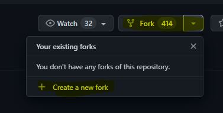
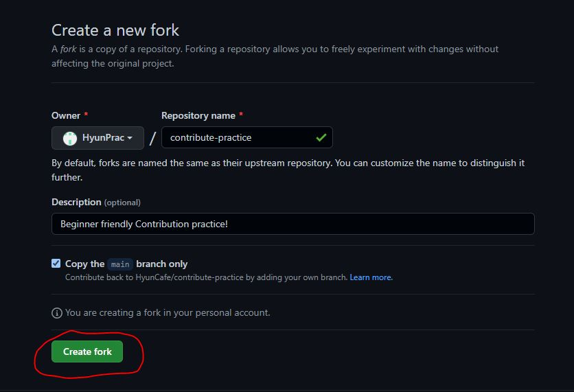
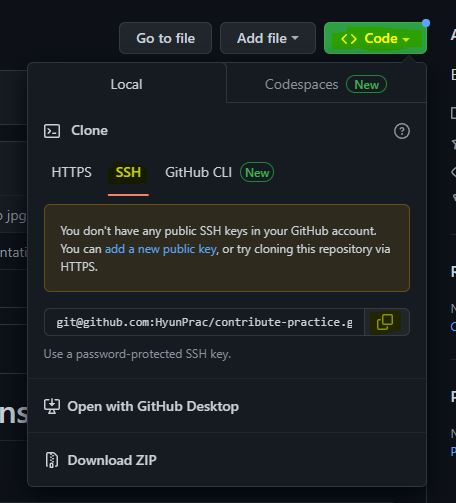
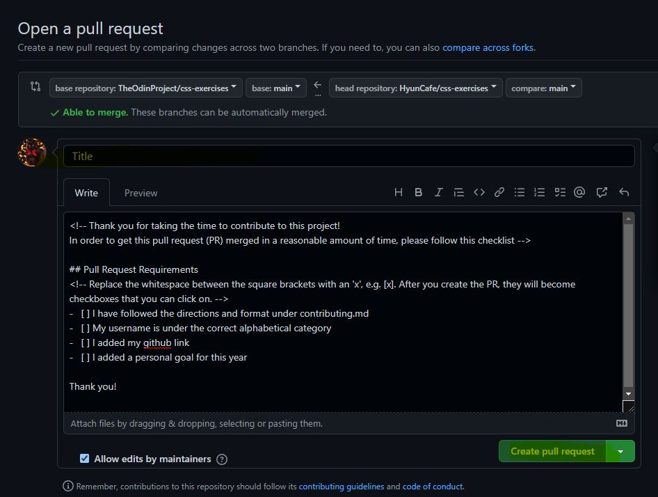

# <p align="center">  First time Practice Contributions! 
</p>

<p align="center">

</p> <br>

## Introduction
Welcome to a beginner-friendly GitHub repository. A great place to start for a first practice contribution!

This repo is designed for first-time contributors to get familiar with the process 
of forking a repo, cloning it to their local machine, making changes, 
and submitting a pull request. 

I've included some simple tasks for you to complete, 
along with step-by-step instructions on how to submit your changes.

Whether you're new to programming or just new to open source contributions, 
this is the perfect place to get started.
So, fork the repo, clone it, and let's get started! <br><br><br>

## Objectives
* Provide an introduction and overview of the repository for first-time contributors.
* Explain the process of forking a repo, cloning it to a local machine, making changes and submitting a pull request.
* Include simple tasks for contributors to complete with step-by-step instructions on how to submit changes.
* Encourage contributors to fork and clone the repo and get started with making contributions. <br><br><br>

## Table of Contents
* [Fork this repo](#Fork-this-repo)
* [Clone this repo](#Clone-this-repo)
* [Create a branch](#Create-a-branch)
* [Making a Pull Request](#Making-a-Pull-Request) 
* [Contributors](#Contributors)  <br>

   <br>

## Fork this repo 
<h2> Step 1 </h2>
 <br>

* Click on the "Fork" drop down button located in the top right corner of the page.

* Click on the "+ Create a new fork* <br><br><br>

<h2> Step 2 </h2>
 <br>

* Click on "Create fork" <br><br>

* Once the repository has been forked, you will be taken to the forked repository's page. <br><br>

* This will be a copy of the original repository, but it will be under your account. <br><br><br><br><br><br><br><br>

## Clone this repo
 <br>
* First, lets click on the "Code" drop down button, click on "SSH" then click the "Copy Icon" <br>

* Then, let's go to our local machine, open the terminal, and create a new directory to put our newly cloned repo in and name it "contribute-practice" 
```
mkdir contribute-practice
```
* and cd into the directory
```
cd contribute-practice
```
* Clone the forked repository to your local machine by typing git clone followed by the SSH link that you copied.
```
git clone copyoftheurlssh
```
<br><br>
## Create a branch
* Now let's create a new branch through the terminal using the git switch BranchName. 

Replace BranchName with the name of the new branch you want to create. 

For example:
```
git switch -c HyunCafe
```
<br><br>
## Contribution time!
* Open the contributing.md file, you can use a text editor of your choice, for example, nano contributing.md or vi contributing.md
I personally use vs code, so I would type:
```
code .
```

*  Follow the directions under the contributing.md and now lets commit your changes!

*  Remember the order for git best practices! <br>
git status >> git add (files changed) >> git commit -m "insert short description of changes made" >> git push

type:
```
git status
```
now you can see the files that were changed, now add them
```
git add (files changed)
```
now lets commit our changes with a short description
```
git commit -m "Add: Added my name to list, My first contribution!"
```
Push the changes to your forked repository on GitHub using the command git push origin BranchName, where BranchName is the name of the branch you are working on.
```
git push -u origin BranchName
```
<br><br>
## Making a Pull Request
<h2> Step 1 </h2>
 <br><br><br><br><br>

* Go to your forked repository on GitHub, click on "contribute" drop down, and click on "Open pull request"<br><br><br>


<br><br><h2> Step 2 </h2>
 <br>

* Fill in the title and description of the pull request to explain the changes you made!

* After filling out the details, click the "Create pull request" button to submit your request for review. <br><br><br><br><br><br><br><br><br><br>


## Great job! All done! Wasn't so bad was it?

<p align="center"><br>

  </p> <br>

*  Congratulations on completing the typical fork, clone, make changes, and pull request workflow commonly used by contributors. Keep up the good work and continue contributing!

* I will get around to merging the request when I can, I am usually good about it! <br><br>


## Contributors


---

**Jump to:** | [A](#a) | [B](#b) | [C](#c) | [D](#d) | [E](#e) | [F](#f) | [G](#g) | [H](#h) | [I](#i) | [J](#j) | [K](#k) | [L](#l) | [M](#m) | [N](#n) | [O](#o) | [P](#p) | [R](#r) | [S](#s) | [T](#t) | [U](#u) | [V](#v) | [W](#w) | [Y](#y) | [Z](#z)

--- 
<br>

## A
* Ashutosh Vaidya (https://github.com/ashutosh-vaidya)<br>
"For the year 2023, my goal is to contribute more to open source projects!"
"Thanks HyunCafe for teaching me how to contribute!"

## B

## C

## D

* Deadrep (https://github.com/Deadrep)<br>
"In 2023, my objective is to engage in open source projects and make connections within the technology field. My goal is to also create a tailored portfolio that showcases my interests and passions with the ultimate aim of securing a job in my desired industry."

## E

## F

## G
* Golluméo (https://github.com/gollumeo)
* "For 2023, my goal is to be a succesful backend web developer, as well as to contribute to open source projects!"

## H

* HyunCafe (https://github.com/HyunCafe)<br>
"For the year 2023, my goal is to contribute more to open source projects!"

* HyunPrac (https://github.com/HyunPrac)<br>
"For the year 2023, my goal is to get more quality sleep!"

## I

## J

## K

* Kappa0x (https://github.com/kappa0x)<br>
"For as long as I can remember, I have been dreaming of achieving something great. Now, I am determined to make that dream a reality before it's too late, as time is an invaluable commodity"

## L

## M

## N

* NitkarshChoursia (https://github.com/NitkarshChourasia)<br>
"For the year 2023, my goal is to achieve my definition of success, I am also planning to be successful on Youtube!"

## O

## P

## Q

## R

## S

## T

## U

## V

## W

## X

## Y

* YouGotHitByGunner (https://github.com/YouGotHitByGunner)<br>
"For the year 2023, my goal is to get a job as a Software Engineer! I'll be learning every day towards that goal and make 2023 my year! Let's go!!"<br>
"Thank you to HyunCafe for teaching me the fundamentals of contributing to open-source projects!"

## Z
